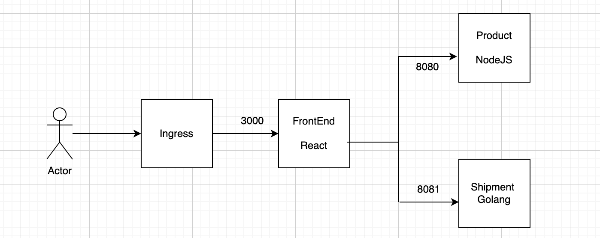
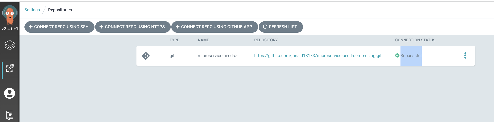
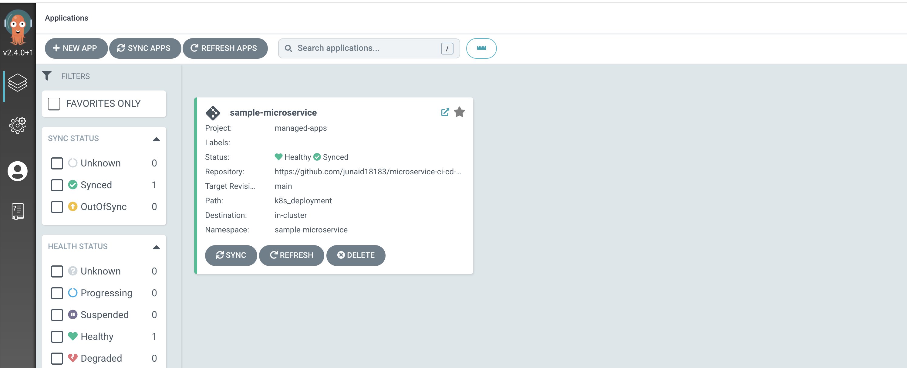

# Prerequisites
- kubernetes cluster. Any cluster can work, for demo I am using local cluster using rancher-desktop
- The Ingress Controller is installed in the Target cluster.


# Sample APP microservice
- Frontend REPO - https://github.com/junaid18183/frontend_microservice_react 
- Product Microservice REPO - https://github.com/junaid18183/product_microservice_sample 
- Shipment Microservice REPO - https://github.com/junaid18183/shipment_microservice_sample 

# Architecutre Diagram 



# Deployment using GitOps

## Install the ArgoCD into the kubernetes cluster

You can install the ArgoCD using below command, it will install the ArgoCD and expose it using ingress.

```
    ❯ kustomize build argo-cd-deployement | kubectl apply -f -
```

## Access the ArgoCD UI

get the ingress URL for the ArgoCD
```
❯ kubectl get ing -n argocd argocd-server
NAME            CLASS    HOSTS               ADDRESS         PORTS   AGE
argocd-server   <none>   argocd.ijuned.com   192.168.0.107   80      2s
```

Make sure to update the ingress created by above kustmization with your required domain. Also in my case I will create a host entry for 

Access the URL argocd.192.168.0.108.nip.io in your Browser. ( It  will take some time for all pods to be up and argoCD UI to be functional.)

To get the `admin` password you can use below command

```
❯ kubectl get secret -n argocd argocd-initial-admin-secret -o jsonpath='{.data.password}' | base64 --decode
fZQPYPw493j39ke1
```

## Connect our GitOps Repository to ArgoCD

We have to connect our gitOps repo i.e. this repo to ArgoCD.<p> So that ArgoCD can sync the configuration for applications.<p>
Ideally for public repo like this we dont need to provide any credentials. <p>
But since we are planning to use *ArgoCD image updater* which needs write access to this repository so that it can update `Kustomization` with new images being pushed to image registries for any of our microservice.<p>
We will add the GitHub Repostiry with Write access Credentails. <p>

Note:  We can use both `https` as well `ssh` URL's while connecting the repository to ArgoCD. 
- If you want to use https, create a github persoanal Access Token and use the `username` and `password` . 
- If you want to use ssh provide just use the `sshPrivateKey` with base64 Encoded data of your SSH key having access to the gitOps repository.


We can create the `ArgoCD Repository` using UI. <p>But to make things simple, there is `argo-cd-deployement/repocreds.yaml.sample` file in this repo. 
Just copy this file to `argo-cd-deployement/repocreds.yaml` and update it with right credentails.

```
❯ cp argo-cd-deployement/repocreds.yaml.sample argo-cd-deployement/repocreds.yaml
```

Note: Since this `argo-cd-deployement/repocreds.yaml` file contains ths sensitive information, please double check that you are not committing it to the GitHub. (adding it in .gitignore file)

Now, we can apply this file and connect our repo to ArgoCD

```
❯ kubectl apply -f argo-cd-deployement/repocreds.yaml
secret/repo-microservice-ci-cd-demo-using-gitops created

```

This will create a secret in argo namespace, and you can confirm from ArgoCD UI, that a repository is connected and *CONNECTION STATUS* is *Successful*




## Create ArgoCD Application

We can create the ArgoCD Application using the UI as well as custom resource. 
<p>For the sake of simplicity we will go with custom resource.
<p>The application defination is present at `argo-cd-deployement/sample_microservice_application.yaml`
<p> Just apply the file

```
❯ kubectl apply -f argo-cd-deployement/sample_microservice_application.yaml
```

And you can see from ArgoCD UI that Application is created.  And withing few seconds it will be synced.



Make a note of the `annotations` which describes how the ArgoCD image Updater will update the various images of the applicaton being synced.

## Verify your application is deployed successfully.

Once the Application is synced successfully, you can check the Application is deployed successfully, and you can even try accessing the frontend app using the Ingress URL(you have to create the host-entry on your local machine)

```
❯ kubectl get all,ing -n sample-microservice
NAME                                READY   STATUS    RESTARTS   AGE
pod/product-api-84bd47cbd7-6fzf2    1/1     Running   0          10m
pod/shipment-api-5996d88d57-gqmrg   1/1     Running   0          10m
pod/frontend-app-68fb78f597-wfgrb   1/1     Running   0          10m

NAME                   TYPE        CLUSTER-IP      EXTERNAL-IP   PORT(S)        AGE
service/product-api    ClusterIP   10.43.21.75     <none>        8800/TCP       10m
service/shipment-api   ClusterIP   10.43.143.115   <none>        8801/TCP       10m
service/frontend-app   NodePort    10.43.120.80    <none>        80:31194/TCP   10m

NAME                           READY   UP-TO-DATE   AVAILABLE   AGE
deployment.apps/product-api    1/1     1            1           10m
deployment.apps/shipment-api   1/1     1            1           10m
deployment.apps/frontend-app   1/1     1            1           10m

NAME                                      DESIRED   CURRENT   READY   AGE
replicaset.apps/product-api-84bd47cbd7    1         1         1       10m
replicaset.apps/shipment-api-5996d88d57   1         1         1       10m
replicaset.apps/frontend-app-68fb78f597   1         1         1       10m

NAME                                     CLASS    HOSTS                  ADDRESS         PORTS   AGE
ingress.networking.k8s.io/frontend-app   <none>   sampleapp.ijuned.com   192.168.0.110   80      10m

```

## Test the CI-CD
You can commit a dummy change either in [FrontEND](https://github.com/junaid18183/frontend_microservice_react)
or [Product](https://github.com/junaid18183/product_microservice_sample)
or [Shipment](https://github.com/junaid18183/shipment_microservice_sample ) Service repositiry.

That commit will create a new image and pushed to github image repositiry.
Once the image is pushed the ArgoCD image updater will get that update, and will update the `k8s_deployment/kustomization.yaml` file [like this](https://github.com/junaid18183/microservice-ci-cd-demo-using-gitops/commit/1930757577540b52cd09bbc7fd69fd68fbd345ad)


# References 
- ArgoCD - https://argo-cd.readthedocs.io/en/stable/
- ArgoCD image updater - https://argocd-image-updater.readthedocs.io/en/stable/