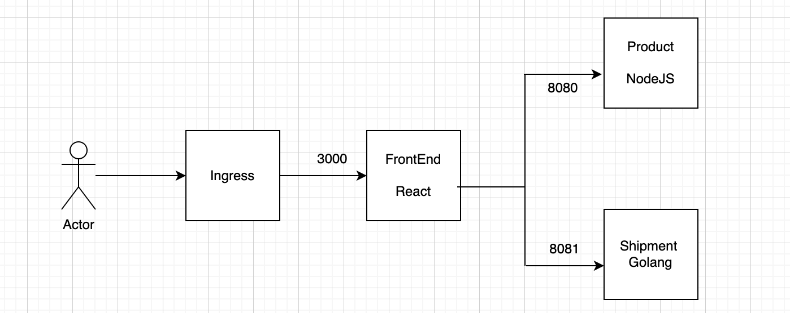

# Prerequisites
- kubernetes cluster, I am using local cluster using rancher-desktop
- The Ingress Controller is installed in the Target cluster.


# Sample APP microservice
- Frontend REPO - https://github.com/junaid18183/frontend_microservice_react 
- Product Microservice REPO - https://github.com/junaid18183/product_microservice_sample 
- Shipment Microservice REPO - https://github.com/junaid18183/shipment_microservice_sample 

## Architecutre Diagram 



# Deployment using GitOps

# Install the ArgoCD

you can simply install the ArgoCD using below command
```
    kustomize build argo-cd-deployement | kubectl apply -f -
```


# Access the ArgoCD UI

get the ingress URL for the ArgoCD
```
kubectl get ing -n argocd argocd-server
NAME            CLASS    HOSTS               ADDRESS         PORTS   AGE
argocd-server   <none>   argocd.ijuned.com   192.168.0.107   80      2s
```

Make sure to update the ingress created by above kustmization with your required domain. Also in my case I will create a host entry for 

Access the URL argocd.192.168.0.108.nip.io in your Browser. ( It  will take some time for all pods to be up and argoCD UI to be functional.)

To get the `admin` password you can use below command

```
kubectl get secret -n argocd argocd-initial-admin-secret -o jsonpath='{.data.password}' | base64 --decode
fZQPYPw493j39ke1
```

# Create the ArgoCD Application

First we will create the Repository in ArgoCD , so that application can use it. Although in our case since our repo is Public its not needed.
But we will eventully need it for *ArgoCD Image Updater to work*

There is a sample file present at `k8s_deployment/repocreds.yaml.sample` copy that to `k8s_deployment/repocreds.yaml` 
And Add your github username and password since we are using the `https` for cloning the repo we have to provide the username/password. If you want to use `ssh` then you can provide the base64 encoded private key.

Create the repository

```
kubectl apply -f k8s_deployment/repocreds.yaml
```

We can create the ArgoCD Application using the UI. But for pure GitOps we will create it using the CRD and commit that application.yaml as well into the REPO.

```
kubectl apply -f argo-cd-deployement/sample_microservice_application.yaml
appproject.argoproj.io/managed-apps created
application.argoproj.io/sample-microservice created
```

# Verify your application is deployed successfully.

```
kubectl get po -n sample-microservice

```

# Test the CI-CD
You can commit a dummy change either in [FrontEND](https://github.com/junaid18183/frontend_microservice_react)
or [Product](https://github.com/junaid18183/product_microservice_sample)
or [Shipment](https://github.com/junaid18183/shipment_microservice_sample )

That change will create a new image and that will be pushed to github image repositiry.
Once the image is pushed the ArgoCD image updater will get that update, and will update the `k8s_deployment/kustomization.yaml` file [like this](https://github.com/junaid18183/microservice-ci-cd-demo-using-gitops/commit/1930757577540b52cd09bbc7fd69fd68fbd345ad)


# References 
- ArgoCD - https://argo-cd.readthedocs.io/en/stable/
- ArgoCD image updater - https://argocd-image-updater.readthedocs.io/en/stable/